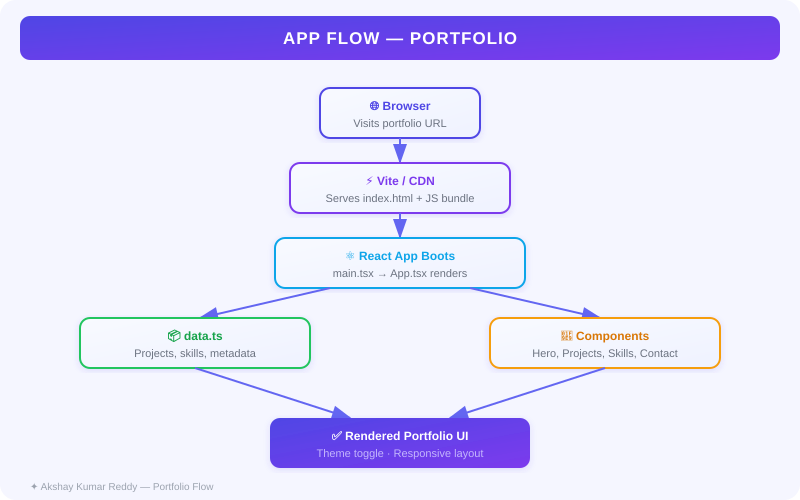
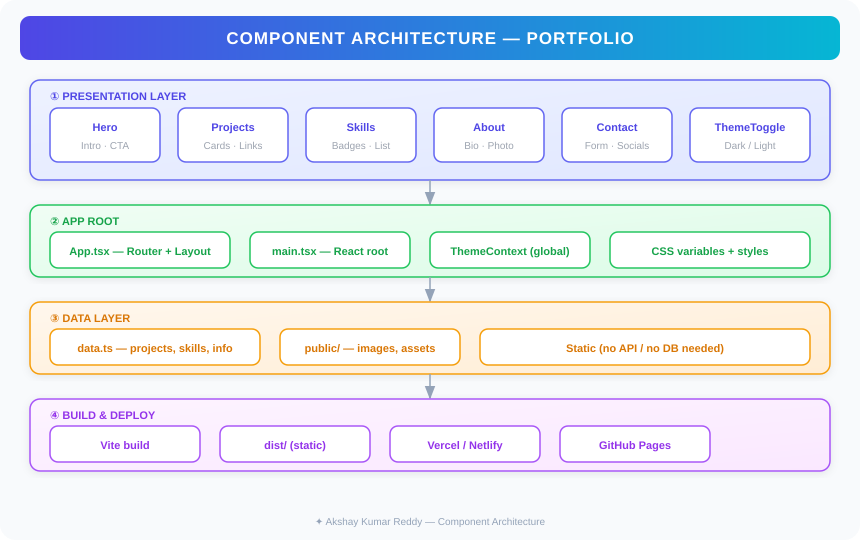

<div align="center">

# ✦ Akshay Kumar Reddy — Portfolio

**A fast, modern, accessible portfolio built with Vite + React + TypeScript**

[](https://portfolio-akshay-five.vercel.app)
[](https://github.com/akshay-kumar-reddy/portfolio)
[](LICENSE)


### 🌐 Live Site → [portfolio-akshay-five.vercel.app](https://portfolio-akshay-five.vercel.app)

</div>

---

## 📌 About

A clean, performant personal portfolio that presents my projects, skills, and story to recruiters and collaborators. Built for speed, accessibility, and easy deployment on any static host.

## ✨ Features

- ⚡ **Vite-powered** — near-instant HMR and lightning-fast builds
- 🌗 **Dark / Light theme toggle** — system preference respected
- 📱 **Mobile-first responsive layout** — looks great on any screen
- ♿ **Accessible** — semantic HTML, keyboard-navigable, screen-reader friendly
- 🗂️ **Component-driven** — easy to extend and maintain
- 🚀 **Static output** — deploy to Vercel, Netlify, or GitHub Pages in minutes

## 🛠️ Tech Stack

| Layer | Tech |
|---|---|
| Framework | React 18 (TypeScript) |
| Bundler | Vite |
| Styling | CSS (utility + custom) |
| Deployment | Vercel / Netlify / GitHub Pages |

## 📁 Project Structure

```
portfolio/
├── public/
│   └── images/          # Static assets (SVGs, screenshots)
├── src/
│   ├── components/      # Reusable UI components
│   ├── data.ts          # Project & content metadata
│   ├── App.tsx          # Root component
│   └── main.tsx         # App entry point
├── index.html
├── vite.config.ts
└── tsconfig.json
```

## 🚀 Getting Started

### Prerequisites
- **Node.js** v18 or later

### Run Locally

```bash
# 1. Clone the repo
git clone https://github.com/akshay-kumar-reddy/portfolio.git
cd portfolio

# 2. Install dependencies
npm install

# 3. Start the dev server
npm run dev
```

Open [http://localhost:5173](http://localhost:5173) in your browser.

### Build for Production

```bash
npm run build       # Output goes to /dist
npm run preview     # Preview the production build locally
```

## ☁️ Deployment

The `/dist` folder is a fully static build — drop it on any host.

| Platform | How to deploy |
|---|---|
| **Vercel** | `vercel --prod` or connect your GitHub repo in the dashboard |
| **Netlify** | Drag-and-drop `/dist` at app.netlify.com, or use the CLI |
| **GitHub Pages** | Push `/dist` to the `gh-pages` branch (use the `gh-pages` npm package) |

## 🗺️ Architecture & Flow

**High-level app flow:**



**Component architecture:**



**Design philosophy:**
- Content and images live in `public/` and are served directly — no runtime data fetching.
- React handles interactivity only (theme toggle, micro-interactions).
- All routing is client-side; no server required.

## 🤝 Contributing

1. Fork the repo and create a feature branch: `git checkout -b feat/your-feature`
2. Make your changes and commit: `git commit -m "feat: add X"`
3. Push to your branch: `git push origin feat/your-feature`
4. Open a Pull Request with a short description of the change

> 🔐 Never commit secrets — use `.env.local` for environment variables and make sure `.env.local` is in your `.gitignore`.

## 📄 License

Released under the [MIT License](LICENSE). Free to use, modify, and distribute.

---

<div align="center">

Made with ☕ by **Akshay Kumar Reddy**

[LinkedIn](https://linkedin.com/in/your-profile) · [GitHub](https://github.com/your-username) · [Email](mailto:your@email.com)

</div>
